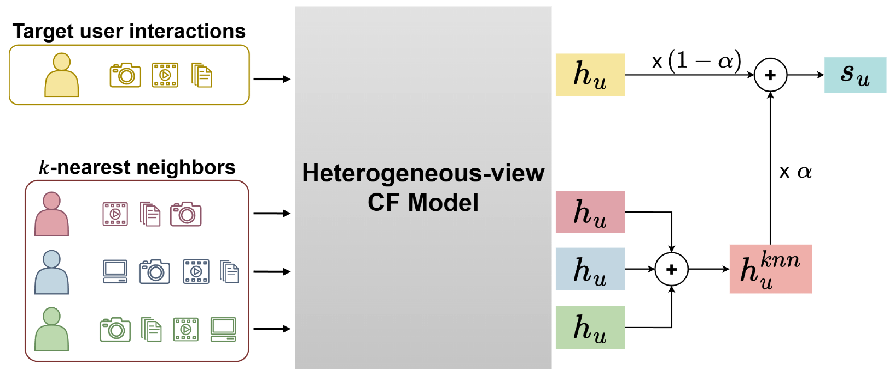

# Revisiting LLM-Enhanced Collaborative Filtering: A Text-Free Alternative with Heterogeneous Interaction Signals

Official PyTorch implementation of **HetRec**, accepted as a short paper at
**CIKM 2026**.

HetRec revisits auxiliary representation alignment for collaborative filtering
and asks whether its benefits require LLM-generated knowledge. Instead of using
text or LLM inference, HetRec constructs complementary user and item
representations from heterogeneous interaction views, enriches them with
similarity-aware k-nearest-neighbor aggregation, and aligns them with a base CF
model through contrastive learning.

**Paper:** [ACM Digital Library / DOI](https://doi.org/10.1145/3799682.3839906)
(the link will become active after publication)

**Publication:** CIKM '26, November 7--11, 2026, Rome, Italy, 5 pages.
The paper is published under the
[Creative Commons Attribution 4.0 International License](https://creativecommons.org/licenses/by/4.0/).

<p align="center">
  
</p>

## Environment

Experiments were conducted on a Linux system with an NVIDIA GPU using the
following software environment:

- Python 3.10
- PyTorch 2.11.0 (CUDA 12.8 build)
- NumPy 2.2.6
- SciPy 1.15.2
- scikit-learn 1.7.2
- PyYAML 6.0.3
- tqdm 4.70.0
- gdown (used only for dataset download)

Create the environment as follows:

```bash
conda create -n hetrec python=3.10 -y
conda activate hetrec

pip install torch==2.11.0 \
  --index-url https://download.pytorch.org/whl/cu128

pip install \
  numpy==2.2.6 \
  scipy==1.15.2 \
  scikit-learn==1.7.2 \
  pyyaml==6.0.3 \
  tqdm==4.70.0 \
  gdown
```

If a different CUDA version is used, install the matching PyTorch and PyTorch
Geometric wheels.

## Data

Download and extract the preprocessed datasets as follows:

```bash
cd data

gdown -O data.zip \
  "https://drive.google.com/uc?id=1057TVnYetztiE2lckpJAj1fgRplLiMXG"

unzip data.zip
mv data/* .
rmdir data
rm data.zip
cd ..
```

Each dataset directory follows this structure:

```text
amazon/  # The same structure is used for yelp and steam.
├── trn_mat.pkl                   # Training interactions
├── val_mat.pkl                   # Validation interactions
├── tst_mat.pkl                   # Test interactions
├── usr_prf.pkl                   # User profile text for the RLMRec baseline
├── itm_prf.pkl                   # Item profile text for the RLMRec baseline
├── usr_emb_np.pkl                # User text embedding for the RLMRec baseline
├── itm_emb_np.pkl                # Item text embedding for the RLMRec baseline
├── usr_emb_bert4rec_knn.pkl      # User BERT4Rec + kNN embedding for HetRec
├── itm_emb_bert4rec_knn.pkl      # Item BERT4Rec + kNN embedding for HetRec
├── usr_emb_item2vec_knn.pkl      # User Item2Vec + kNN embedding for HetRec
└── itm_emb_item2vec_knn.pkl      # Item Item2Vec + kNN embedding for HetRec
```

The interaction-derived auxiliary embeddings are precomputed offline. Running
HetRec therefore requires neither text input nor an LLM API.

## Usage

Replace `<model>` and `<dataset>` with one of the supported names listed below.

### Backbone

```bash
python encoder/train_encoder.py \
  --model <model> \
  --dataset <dataset> \
  --cuda 0
```

### RLMRec baseline

```bash
python encoder/train_encoder.py \
  --model <model>_plus \
  --dataset <dataset> \
  --emb np \
  --cuda 0
```

### HetRec with BERT4Rec auxiliary embeddings

```bash
python encoder/train_encoder.py \
  --model <model>_plus \
  --dataset <dataset> \
  --emb bert4rec_knn \
  --cuda 0
```

### HetRec with Item2Vec auxiliary embeddings

```bash
python encoder/train_encoder.py \
  --model <model>_plus \
  --dataset <dataset> \
  --emb item2vec_knn \
  --cuda 0
```

Supported options:

- `<model>`: `sgl`, `simgcl`, `gccf`, `autocf`, or `lightgcn`
- `<dataset>`: `amazon`, `yelp`, or `steam`

For example:

```bash
python encoder/train_encoder.py \
  --model sgl_plus \
  --dataset amazon \
  --emb bert4rec_knn \
  --cuda 0
```

## Citation

If you find this repository useful, please cite our paper:

```bibtex
@inproceedings{lim2026revisiting,
  author    = {Lim, Jaeeun and Lee, Jae-woong},
  title     = {Revisiting {LLM}-Enhanced Collaborative Filtering: A Text-Free Alternative with Heterogeneous Interaction Signals},
  booktitle = {Proceedings of the 35th ACM International Conference on Information and Knowledge Management},
  year      = {2026},
  month     = nov,
  publisher = {Association for Computing Machinery},
  address   = {New York, NY, USA},
  location  = {Rome, Italy},
  numpages  = {5},
  isbn      = {979-8-4007-2539-5/2026/11},
  doi       = {10.1145/3799682.3839906},
  url       = {https://doi.org/10.1145/3799682.3839906}
}
```

Publication metadata such as page numbers can be added after the ACM Digital
Library record becomes available.

## Acknowledgments

This work was supported by the 2026 Research Grant from Kangwon National
University (Project No. 202605170001); the Institute of Information
Communications Technology Planning Evaluation (IITP)–Innovative Human Resource
Development for Local Intellectualization program grant funded by the Korea
government (MSIT) (IITP-2026-RS-2023-00260267); and the National Research
Foundation of Korea (NRF) grant funded by the Korea government (MSIT)
(RS-2023-00242528).

This implementation builds upon
[RLMRec](https://github.com/HKUDS/RLMRec). We thank the authors for making their
code publicly available.

## License

This project is released under the [Apache License 2.0](LICENSE). Please also
comply with the licenses and terms of the upstream codebases and datasets used
in this project.
